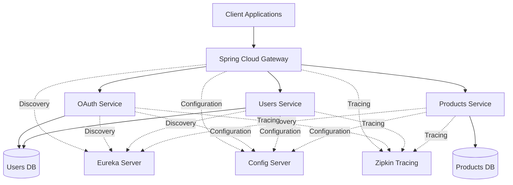

# 🧠 Spring Cloud Microservices Showcase

An enterprise-inspired microservices platform built with **Java 21**, **Spring Boot 3**, and **Spring Cloud**.

This project demonstrates how to design and implement a distributed backend architecture using industry-standard patterns such as **API Gateway**, **Service Discovery**, **Centralized Configuration**, **OAuth2/JWT authentication**, **distributed tracing**, and **containerized deployment**.

It showcases modern backend engineering practices focused on **scalability**, **security**, **resilience**, **observability**, and **cloud-native application development**.
---

## 🚀 Technologies and Tools

### ☕ Backend
- Java 21
- Spring Boot 3
- Spring Cloud

### 🌐 Microservices
- Spring Cloud Gateway
- Eureka Server
- Spring Cloud Config Server
- Spring Cloud LoadBalancer

### 🔐 Security
- Spring Security
- OAuth2.1
- JWT

### 💾 Data
- Spring Data JPA
- Hibernate
- MySQL 8

### 🔄 Service Communication
- OpenFeign
- WebClient

### 📊 Observability
- Micrometer Tracing
- Zipkin

### ☁️ Cloud & DevOps
- Docker
- Docker Compose
- AWS
---

## 🧩 Included Microservices

| Component | Responsibility |
|-----------|----------------|
| **Eureka Server** | Provides service discovery and dynamic registration for all microservices. |
| **Config Server** | Centralizes externalized configuration shared across the platform. |
| **API Gateway** | Acts as the single entry point, handling routing, security, and request forwarding. |
| **Users Service** | Manages user information and exposes user-related business operations. |
| **Products Service** | Handles product catalog management and business logic. |
| **OAuth Service** | Provides authentication, authorization, and JWT token generation. |
| **Commons Library** | Contains shared DTOs, utilities, exceptions, and common components used across services. |
| **Zipkin** | Collects and visualizes distributed traces for observability. |
| **Docker Compose** | Orchestrates the complete local development environment. |
---

## 🏗️ Architecture Overview
The platform follows a cloud-native microservices architecture where each service has a single responsibility. Service discovery, centralized configuration, authentication, and distributed tracing are handled by dedicated infrastructure components.



---

## 🎯 Architecture Highlights

- API Gateway acts as the single entry point for all client requests.
- Eureka Server provides service discovery and dynamic registration.
- Config Server centralizes configuration management across services.
- OAuth Service manages authentication and JWT token generation.
- Distributed tracing is implemented using Micrometer and Zipkin.
- Services communicate through REST APIs and leverage Spring Cloud LoadBalancer.
- Docker Compose orchestrates the complete local environment.
- The platform follows cloud-native and microservices architecture principles.

---

## 📦 Key Features

- REST-based inter-service communication
- Dynamic service discovery with Eureka
- Client-side load balancing
- OAuth2 and JWT-based authentication
- Centralized API Gateway security
- Externalized and centralized configuration
- Distributed tracing with Zipkin
- Fault tolerance with Resilience4J
- Full containerization using Docker
- Ready for deployment on AWS EC2

---

## 🧪 How to Run

```bash
docker-compose up --build
```

After startup:

- Eureka Dashboard → http://localhost:8761
- API Gateway → http://localhost:8090
- Zipkin → http://localhost:9411

---

## 👨‍💻 Author

**Freyder Otalvaro**

Senior Software Engineer | Java | AWS | Distributed Systems

- GitHub: https://github.com/freyderdev
- LinkedIn: https://www.linkedin.com/in/freyder-otalvaro-70484b73/
- Location: Colombia 🇨🇴
