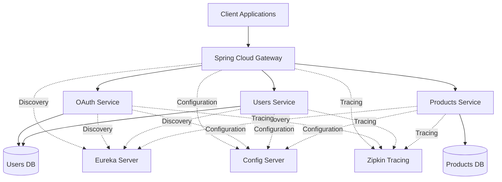

# 🧠 Spring Cloud Microservices Showcase

This project implements a distributed architecture based on microservices using **Spring Boot 3** and **Spring Cloud**.

It is designed to demonstrate best practices in backend development, scalability, security, observability, and cloud-native architecture by integrating multiple components of the Spring ecosystem.

---

## 🚀 Technologies and Tools

- **Spring Boot 3**
- **Spring Cloud Gateway**
- **Eureka Server**
- **Spring Cloud Config Server**
- **Spring Cloud LoadBalancer**
- **OAuth2.1**, **JWT**, **Spring Security**
- **Micrometer Tracing**, **Zipkin**
- **Spring Data JPA**, **Hibernate**
- **MySQL 8**
- **WebClient**, **Feign Client**
- **Docker**, **Docker Compose**
- **AWS**

---

## 🧩 Included Microservices

- `eureka-server` → Service registry and discovery
- `config-server` → Centralized configuration management
- `msvc-gateway-server` → API Gateway and routing
- `msvc-products` → Product management service
- `msvc-users` → User management service
- `msvc-oauth` → Authentication and authorization service
- `libs-msvc-commons` → Shared libraries and common components
- `zipkin` → Distributed tracing and observability
- `docker-compose` → Local orchestration environment

---

## 🏗️ Architecture Overview



---

## 🎯 Architecture Highlights

- API Gateway acts as the single entry point for all client requests.
- Eureka Server provides service discovery and dynamic registration.
- Config Server centralizes configuration management across services.
- OAuth Service manages authentication and JWT token generation.
- Distributed tracing is implemented using Micrometer and Zipkin.
- Services communicate through REST APIs and leverage Spring Cloud LoadBalancer.
- Docker Compose orchestrates the complete local environment.
- The platform follows cloud-native and microservices architecture principles.

---

## 📦 Key Features

- REST-based inter-service communication
- Dynamic service discovery with Eureka
- Client-side load balancing
- OAuth2 and JWT-based authentication
- Centralized API Gateway security
- Externalized and centralized configuration
- Distributed tracing with Zipkin
- Fault tolerance with Resilience4J
- Full containerization using Docker
- Ready for deployment on AWS EC2

---

## 🧪 How to Run

```bash
docker-compose up --build
```

After startup:

- Eureka Dashboard → http://localhost:8761
- API Gateway → http://localhost:8090
- Zipkin → http://localhost:9411

---

## 👨‍💻 Author

**Freyder Otalvaro**

Senior Software Engineer | Java | AWS | Distributed Systems

- GitHub: https://github.com/freyderdev
- LinkedIn: https://www.linkedin.com/in/freyder-otalvaro-70484b73/
- Location: Colombia 🇨🇴
